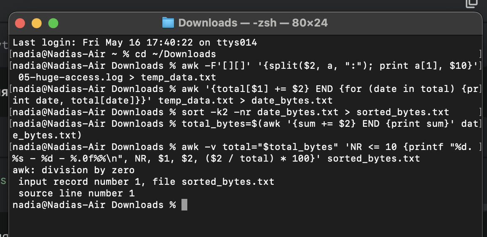

# Звіт до комп'ютерного практикуму №2  
## Написання shell-скриптів  

---

## Мета роботи

Ознайомитися з можливостями командної оболонки Linux для обробки лог-файлів. Отримати навички використання інструментів `awk`, `sort`, `head` тощо, для аналізу веб-логів.

---

## Умова (варіант 16)

Виведіть списком 10 хостів, які пришли через реферера,
відсортованих за кількістю реферерів (до 10 елементів списку, починаючи з
найбільшого значення, в порядку спадання), з рядками у форматі <хост> -
<кількість реферерів для цього хоста, числом> - <відсоток цієї кількості від
загальної кількості реферерів для всіх цих хостів>
## Приклад виводу:
```
1. lj612152.inktomisearch.com - 10 - 59%
2. ac914c7e.ipt.aol.com - 5 - 29%
3. fj301012.inktomisearch.com - 2 - 12%
```

---

## Опис виконаних дій

1. Написано shell-скрипт `process_logs.sh`, який працює з логами у форматі Apache Access Log.
2. Скрипт використовує утиліту `awk` для:
   - вилучення кількості переданих байтів (останнє поле перед User-Agent);
   - підрахунку сумарної кількості байтів для кожної дати.
   - обрахунок відсотків.
3. Отримані дані виводяться у форматі `<дата> <байти>` в стандартний вивід.
4. Далі ці результати сортуються командою `sort -k2 -nr` за спаданням кількості байтів.
5. За допомогою `head -n 10` виводиться топ-10 дат.

---

## Код скрипта

```sh
if [ -z "$1" ]; then
  echo "Usage: $0 <log_file_name>"
  echo "Error: No log file specified."
  exit 1
fi

LOG_FILE="$1"

if [ ! -r "$LOG_FILE" ]; then
  echo "Error: Log file '$LOG_FILE' not found or not readable."
  exit 1
fi

top_10_data=$(awk -F'"' '
{
    n = split($0, fields, "\"");
    if (n >= 4 && fields[4] != "-" && fields[4] != "") {
        split(fields[1], host_parts, " ");
        if (host_parts[1] != "") {
            print host_parts[1];
        }
    }
}
' "$LOG_FILE" | sort | uniq -c | sort -nr | head -n 10)

if [ -z "$top_10_data" ]; then
  echo "No hosts found with referrers in '$LOG_FILE'."
  exit 0
fi

total_referrers_for_top_10=$(echo "$top_10_data" | awk '{sum += $1} END {print sum}')

if [ -z "$total_referrers_for_top_10" ] || [ "$total_referrers_for_top_10" -eq 0 ]; then
  echo "Top 10 hosts by referrer count (total referrers is 0, cannot calculate percentage):"
  echo "$top_10_data" | awk 'BEGIN {rank=1} {count=$1; host=$2; printf "%d. %s - %d - N/A%%\n", rank, host, count; rank++}'
  exit 0
fi

echo "Top 10 hosts by referrer count from '$LOG_FILE':"
echo "$top_10_data" | awk -v total_sum="$total_referrers_for_top_10" '
BEGIN { rank = 1 }
{
    count = $1;
    host = $2; 
    percentage = (count / total_sum) * 100;
    printf "%d. %s - %d - %.0f%%\n", rank, host, count, percentage;
    rank++;
}'
```


## Висновки

- За допомогою shell-інструментів реалізовано базову обробку лог-файлів.
- Отримано навички роботи з `awk`, `sort`, `head`.

---

##  Результати виконання

